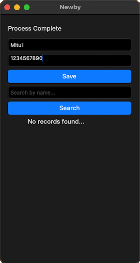
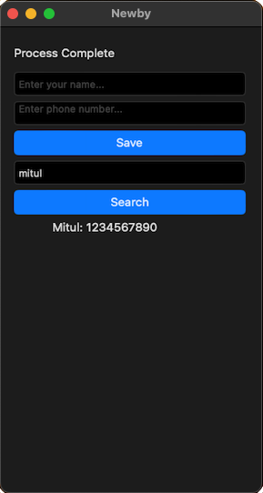

# Newby (ObjC)

It's true that some people, particularly newbies, fall into the Web like Alice
down the rabbit hole.

Contact app using CoreData with Storyboard based UI and ObjectiveC
implementation.

## Preview

 

# Interface and Implementation

In **Objective C**, the file where the declaration of `class` is done is called
the `interface` file and the file where the `class` is defined is called the
`implementation` file.

## A simple `interface` file `MyClass.h` would look like the following:

```ObjC
@interface MyClass:NSObject {
    // class variable declared here
    int *count;
}

// class properties declared here
NSString*name;
NSString*number;

// class methods and instance methods declared here
+(int)getCount;
-(NSString)getName;
-(BOOL)saveWithName:(NSString*)name andNumber:(NSString*)number;
-(NSDictionary*)findByName:(NSString*)name;

@end
```

## The implementation file MyClass.m would be as follows:

```ObjC
@interface MyClass ()
    // Define additional properties (?extension block)
@end

@implementation MyClass

+(int)getCount {
    // static method body
}

-(NSString)getName {
    // instance method body
}
@end
```

## Custom Layout

```objc
@property (nonatomic, strong) UIButton *leftButton;
@property (nonatomic, strong) UIButton *rightButton;
@property (nonatomic, strong) UITextField *textfield;

UIView *superview = self.view;

/* 1. Create leftButton and add to our view */
self.leftButton = [UIButton buttonWithType:UIButtonTypeRoundedRect];
self.leftButton.translatesAutoresizingMaskIntoConstraints = NO;
[self.leftButton setTitle:@"LeftButton" forState:UIControlStateNormal];
[self.view addSubview:self.leftButton];

/* 2. Constraint to position LeftButton's X */
NSLayoutConstraint *leftButtonXConstraint = [
    NSLayoutConstraint
    constraintWithItem:self.leftButton
    attribute:NSLayoutAttributeCenterX
    relatedBy:NSLayoutRelationGreaterThanOrEqual
    toItem:superview
    attribute:NSLayoutAttributeCenterX
    multiplier:1.0
    constant:-60.0f];

/* 3. Constraint to position LeftButton's Y */
NSLayoutConstraint *leftButtonYConstraint = [
    NSLayoutConstraint
    constraintWithItem:self.leftButton
    attribute:NSLayoutAttributeCenterY
    relatedBy:NSLayoutRelationEqual
    toItem:superview
    attribute:NSLayoutAttributeCenterY
    multiplier:1.0f
    constant:0.0f];

/* 4. Add the constraints to button's superview */
[superview addConstraints:@[ leftButtonXConstraint, leftButtonYConstraint]];

/* 5. Create rightButton and add to our view */
self.rightButton = [UIButton buttonWithType:UIButtonTypeRoundedRect];
self.rightButton.translatesAutoresizingMaskIntoConstraints = NO;
[self.rightButton setTitle:@"RightButton" forState:UIControlStateNormal];
[self.view addSubview:self.rightButton];

/* 6. Constraint to position RightButton's X */
NSLayoutConstraint *rightButtonXConstraint = [
    NSLayoutConstraint
    constraintWithItem:self.rightButton
    attribute:NSLayoutAttributeCenterX
    relatedBy:NSLayoutRelationGreaterThanOrEqual
    toItem:superview
    attribute:NSLayoutAttributeCenterX
    multiplier:1.0
    constant:60.0f];

/* 7. Constraint to position RightButton's Y */
rightButtonXConstraint.priority = UILayoutPriorityDefaultHigh;
NSLayoutConstraint *centerYMyConstraint = [
    NSLayoutConstraint
    constraintWithItem:self.rightButton
    attribute:NSLayoutAttributeCenterY
    relatedBy:NSLayoutRelationGreaterThanOrEqual
    toItem:superview
    attribute:NSLayoutAttributeCenterY
    multiplier:1.0f
    constant:0.0f];

[superview addConstraints:@[centerYMyConstraint, rightButtonXConstraint]];

/* 8. Add Text field */
self.textfield = [[UITextField alloc]initWithFrame:CGRectMake(0, 100, 100, 30)];
self.textfield.borderStyle = UITextBorderStyleRoundedRect;
self.textfield.translatesAutoresizingMaskIntoConstraints = NO;
[self.view addSubview:self.textfield];

/* 9. Text field Constraints */
NSLayoutConstraint *textFieldTopConstraint = [
    NSLayoutConstraint
    constraintWithItem:self.textfield
    attribute:NSLayoutAttributeTop
    relatedBy:NSLayoutRelationGreaterThanOrEqual
    toItem:superview
    attribute:NSLayoutAttributeTop
    multiplier:1.0
    constant:60.0f];

NSLayoutConstraint *textFieldBottomConstraint = [
    NSLayoutConstraint
    constraintWithItem:self.textfield
    attribute:NSLayoutAttributeTop
    relatedBy:NSLayoutRelationGreaterThanOrEqual
    toItem:self.rightButton
    attribute:NSLayoutAttributeTop
    multiplier:0.8
    constant:-60.0f];

NSLayoutConstraint *textFieldLeftConstraint = [
    NSLayoutConstraint
    constraintWithItem:self.textfield
    attribute:NSLayoutAttributeLeft
    relatedBy:NSLayoutRelationEqual
    toItem:superview
    attribute:NSLayoutAttributeLeft
    multiplier:1.0
    constant:30.0f];

NSLayoutConstraint *textFieldRightConstraint = [
    NSLayoutConstraint
    constraintWithItem:self.textfield
    attribute:NSLayoutAttributeRight
    relatedBy:NSLayoutRelationEqual
    toItem:superview
    attribute:NSLayoutAttributeRight
    multiplier:1.0
    constant:-30.0f];

[superview addConstraints:@[
    textFieldBottomConstraint,
    textFieldLeftConstraint,
    textFieldRightConstraint,
    textFieldTopConstraint]];
```

# Login (Swift)

## SceneDelegete.swift

```swift
import UIKit

class SceneDelegate: UIResponder, UIWindowSceneDelegate {
    var window: UIWindow?

    func sceneDidEnterBackground(_ scene: UIScene) {
        (UIApplication.shared.delegate as? AppDelegate)?.saveContext()
    }
}
```

## AppDelegate.swift

```swift
import UIKit
import CoreData

@main
class AppDelegate: UIResponder, UIApplicationDelegate {
    // Core Data stack
    lazy var persistentContainer: NSPersistentContainer = {
        let container = NSPersistentContainer(name: "Contacts")
        container.loadPersistentStores(completionHandler: { (storeDescription, error) in
            if let error = error as NSError? {
                fatalError("Unresolved error: \(error.localizedDescription)")
            }
        })
        return container
    }()

    // Core Data Saving support
    func saveContext () {
        let context = persistentContainer.viewContext
        if context.hasChanges {
            do {
                try context.save()
            } catch {
                if let error = error as NSError? {
                    fatalError("Unresolved error: \(error.localizedDescription)")
                }
            }
        }
    }
}
```

## ViewController.swift

```swift
import UIKit
import CoreData

class ViewController: UIViewController {
    private let data = UserDefaults.standard
    lazy private var appDelegate: AppDelegate = { UIApplication.shared.delegate as! AppDelegate }()
    lazy private var context: NSManagedObjectContext = { appDelegate.persistentContainer.viewContext }()

    private let username = UITextField()
    private let password = UITextField()

    func save() {
        var user: [String:String] = [:]
        if let name = username.text, let phone = password.text {
            user.updateValue(name, forKey: "username")
            user.updateValue(phone, forKey: "password")
        }
        let index = data.integer(forKey: "index")
        data.setValue(user, forKey: String(index))
        data.setValue(index+1, forKey: "index")
    }

    func register() {
        let values = NSEntityDescription.insertNewObject(forEntityName: "Contacts", into: context)
        if let user = username.text, let pass = password.text {
            values.setValue(user, forKey: "username")
            values.setValue(pass, forKey: "password")
        }
        do {
            try context.save()
        } catch {
            if let error = error as NSError? {
                fatalError("Unable to save: \(error.localizedDescription)")
            }
        }
    }

    func login() {
        let request = NSFetchRequest<NSFetchRequestResult>(entityName: "Contacts")
        do {
            let results = try context.fetch(request)
            if results.count > 0 {
                for result in results as! [NSManagedObject] {
                    let _ = result.value(forKey: "username") as? String
                    let _ = result.value(forKey: "password") as? String
                }
            }
        } catch {
            if let error = error as NSError? {
                fatalError("Unable to read: \(error.localizedDescription)")
            }
        }
    }
}
```
